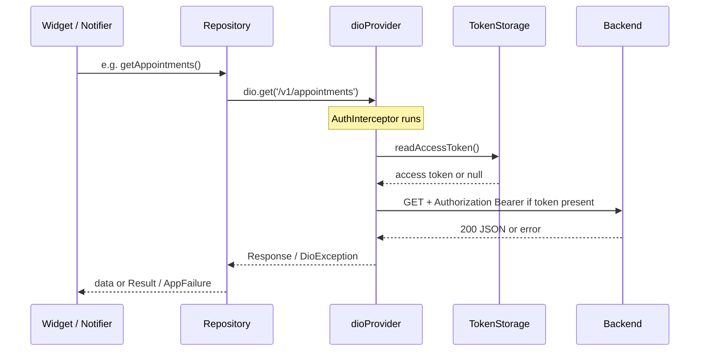
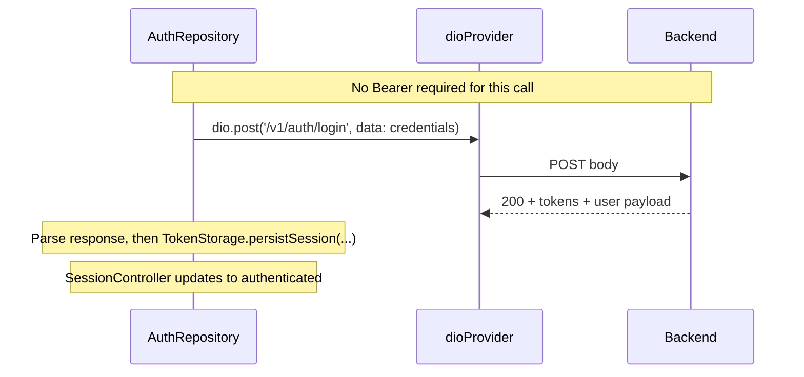
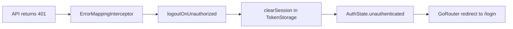

# Auth, session, tokens, and Dio (login flow)

This doc ties together **Riverpod**, **Dio**, **secure token storage**, and **routing** for **signed-in** vs **signed-out** users. Read **[riverpod.md](riverpod.md)** and **[dio.md](dio.md)** first if those pieces are new.

---

## Folder structure (this project)

| Area | Paths | Responsibility |
|------|--------|----------------|
| **Config** | `lib/core/config/` | `AppConfig`, `baseUrl` — no hard-coded API URLs in features. |
| **HTTP (Dio)** | `lib/core/network/` | `dio_provider.dart` — one shared `Dio`; `dio_interceptors.dart` — Bearer token + error mapping. |
| **Session + token** | `lib/core/auth/` | `token_storage.dart` — persist/read/clear tokens + cached `User` JSON; `session_controller.dart` — `AuthState`; `user.dart`, `auth_state.dart`. |
| **Navigation** | `lib/core/routing/` | Redirects: splash while loading → `/login` or role home. |
| **Login UI (scaffold)** | `lib/features/auth/presentation/` | `login_screen.dart` (mock roles today), `splash_screen.dart`. |

**When you add real login**, prefer:

- `lib/features/auth/domain/` — repository interface, entities (no Flutter/Dio imports).
- `lib/features/auth/data/` — `AuthRepository` implementation using `ref.watch(dioProvider)`; `*_providers.dart` for Riverpod.
- `lib/features/auth/presentation/` — forms, buttons, error UI.

Widgets **never** construct `Dio` or read `FlutterSecureStorage` directly; they use **providers** and **notifiers**.

---

## Session vs token (mental model)

| Concept | What it is | Where |
|--------|------------|--------|
| **Token** | Access string (optional refresh later). Proves who you are to the API. | `TokenStorage` → `flutter_secure_storage`. |
| **Session** | App state: signed out vs signed in as which `User`. | `SessionController` → `AsyncValue<AuthState>`. |

- **Login success:** write token + user to storage, then update session to `authenticated(user)`.
- **Logout / 401:** clear storage, set session to `unauthenticated`.
- **Each API request:** `AuthInterceptor` reads the access token from storage and sets `Authorization: Bearer …` (if a token exists).

---

## Chart: cold start → splash → login or home

```mermaid
flowchart TD
  A[App starts main.dart] --> B[ProviderScope + AppConfig]
  B --> C[SessionController.build]
  C --> D{Token in SecureStorage?}
  D -->|No| E[AuthState.unauthenticated]
  D -->|Yes| F{User JSON valid?}
  F -->|No| G[clearSession]
  G --> E
  F -->|Yes| H[AuthState.authenticated]
  E --> I[GoRouter redirect to /login]
  H --> J[GoRouter redirect to role home]
```



---

## Chart: authenticated API request (after login)

Same **`dioProvider`** for all calls. The interceptor adds the header; repositories do not paste tokens manually.



---

## Chart: unauthenticated / public API (e.g. real login)

**Public endpoints** (login, register, refresh token) use the **same** `Dio` instance. If there is **no** token in storage yet, the interceptor does not add `Authorization` (your code only sets the header when the token is non-empty).



**Important:** today the app uses **`loginMock`** (no HTTP). When the backend exists, the **pattern** is: POST login → persist session → refresh auth state (see `SessionController`).

---

## Chart: 401 → clear session → back to login



---

## Pseudocode examples

### Unauthenticated call (login — future real API)

```dart
// Concept only: place in AuthRepository in features/auth/data/
Future<void> signIn(String email, String password) async {
  final dio = ref.read(dioProvider);
  final res = await dio.post<Map<String, dynamic>>(
    '/v1/auth/login',
    data: {'email': email, 'password': password},
  );
  final access = res.data!['access_token'] as String;
  final user = User.fromJson(res.data!['user'] as Map<String, dynamic>);
  await ref.read(tokenStorageProvider).persistSession(
    accessToken: access,
    user: user,
  );
  // Then update SessionController (expose a method like applySignedInUser(user))
}
```

### Authenticated call (any protected endpoint)

```dart
final dio = ref.read(dioProvider);
final res = await dio.get('/v1/appointments');
// Bearer is attached automatically when a token exists in storage.
```

---

## Summary table

| Concern | Implementation | Behavior |
|--------|----------------|----------|
| Store token + user snapshot | `TokenStorage` | `persistSession`, `readAccessToken`, `readUser`, `clearSession` |
| App “signed in?” | `sessionControllerProvider` | Drives `GoRouter` redirects |
| Attach token to HTTP | `AuthInterceptor` on shared `Dio` | Reads storage per request |
| Public vs protected | Same `Dio` | Public: no token; protected: token expected; 401 → logout |

---

## Related docs

- [riverpod.md](riverpod.md) — providers, `SessionController`, overrides.
- [dio.md](dio.md) — interceptors, errors, cancel tokens.
- [go-router.md](go-router.md) — `/splash`, `/login`, role branches.

**Mermaid:** Diagrams render on GitHub and many Markdown viewers. In plain editors, you will see the ` ```mermaid ` blocks as source; use preview that supports Mermaid if needed.
